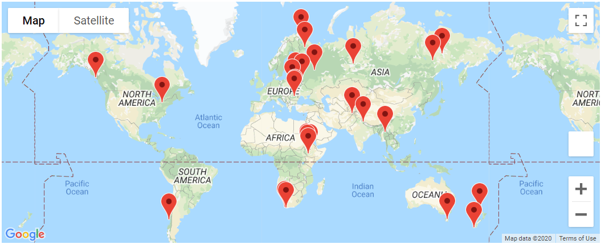
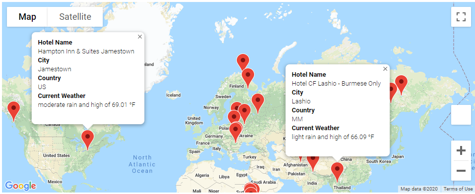
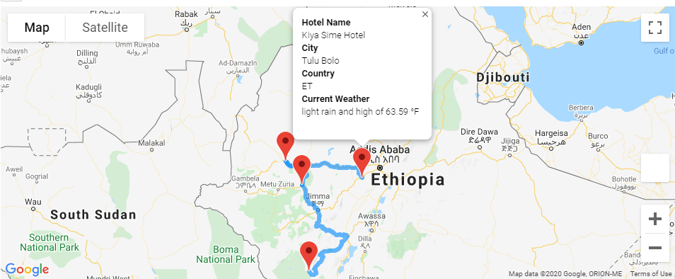

# Module 6 Challenge - WeatherPy

For the new modifications to the PlanMyTrip app, you are asked to add more data to the database, or cities DataFrame, so that customers know the weather in the cities when they click on a pop-up marker. You’ll also need to add the amount of rainfall or snowfall within the last three hours so that customers can filter the DataFrame using input statements based on the temperature range and whether or not it is raining or snowing. Finally, you’ll need to create a directions layer Google map that shows the directions between multiple cities for travel.

## Challenge Overview

The goals for this challenge are to:

- Use nested try-except blocks.
- Use Pandas methods and attributes on a DataFrame or Series.
- Create a new DataFrame from a new API search with new weather parameters.
- Filter DataFrames based on input and nested decision statements, and logical expressions.
- Create pop-up markers on a Google map from a filtered DataFrame.
- Add a directions layer on a Google map between cities in the filtered DataFrame.

## Resources

Data Source: WeatherPy_challenge.csv and WeatherPy_vacation.csv

Software: Python 3.7.6 with pandas, numpy, citipy, and requests dependencies; Anaconda; Jupyter Notebook

APIs: gmaps, openweathermap

## Challenge Summary

### WeatherPy Vacation Map

### WeatherPy Vacation Map with Pop Up Markers

### WeatherPy Travel Map

### WeatherPy Travel Map with Pop Up Markers

